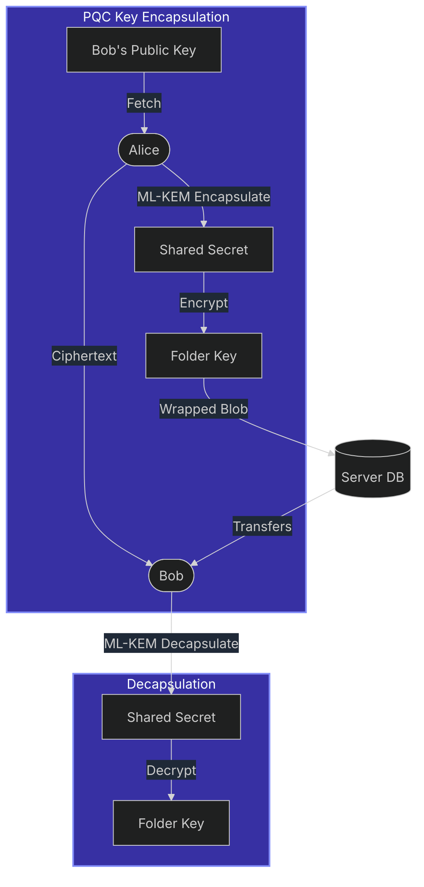

# Aegis


**Aegis** is a quantum-safe productivity suite designed for students. It provides end-to-end encryption for your tasks, files, calendar events, and collaborative spaces using post-quantum cryptography (PQC) to ensure your data remains secure both today and against future quantum threats.

---

## ✨ Key Features

### 🔐 Post-Quantum Security
- **ML-KEM-768 (CRYSTALS-Kyber)** — NIST-standardized post-quantum key encapsulation mechanism for quantum-resistant key exchange
- **Hybrid Encryption** — Combines AES-256-GCM for data confidentiality with PQC for key establishment
- **Client-Side Encryption** — All sensitive data encrypted in-browser before transmission; backend never sees plaintext
- **Zero-Knowledge Architecture** — Private keys derived from user passwords, never stored on servers

### 📁 Secure File Vault
- End-to-end encrypted file storage with **Google Drive** as backend storage
- **Folder-based organization** with per-folder encryption keys
- **Streaming uploads/downloads** for memory efficiency
- Encrypted file sharing via PQC key encapsulation
- Public share links with encrypted key bundles

### ✅ Task Management
- **Kanban board** with drag-and-drop (mobile-friendly via @dnd-kit)
- Priority levels, due dates, and status tracking
- End-to-end encrypted task titles, descriptions, and notes
- **Merkle-tree hashing** for task integrity verification

### 📅 Calendar
- **FullCalendar** integration with day/week/month views
- Encrypted event titles, descriptions, and locations
- Recurring events support
- Event-task linking via mentions

### 📊 GPA Tracker
- Semester-by-semester GPA tracking with course management
- **Merkle Tree integrity verification** — cryptographic proof that grades haven't been tampered with
- Visual analytics with trend charts
- Encrypted course data

### 💬 Social Rooms
- Create encrypted collaborative spaces ("rooms")
- Share and curate **links with rich previews** (auto-scraped)
- Organize links into **collections**
- Encrypted comments and discussions
- Invite-based access with PQC key sharing

### 🔑 Authentication
- **Argon2** password hashing (memory-hard KDF)
- **WebAuthn/Passkeys** for passwordless 2FA
- Session management with secure HTTP-only cookies
- Deterministic PQC key derivation from passwords

---

## 🛡️ Security Architecture

### Defense-in-Depth

The security model relies on a **Zero-Knowledge Architecture** where the server never possesses the keys to decrypt user data.

#### 1. Authentication & Key Derivation
Aegis uses a dual-purpose derivation strategy. The user's password is used to generate both an authentication hash (Argon2) and a completely separate cryptographic seed for client-side encryption.

```mermaid
%%{init: {'theme': 'dark', 'themeVariables': { 'fontFamily': 'Inter', 'edgeLabelBackground': '#1f2937' }}}%%
flowchart LR
    User([User]) -->|Password| KDF[Argon2 KDF]
    
    subgraph Client [Client-Side Browser]
        KDF -->|Derived| AuthHash[Auth Hash]
        KDF -->|Derived| Seed[64-byte Seed]
        
        Seed -->|Derive| PQC[PQC Keypair\nML-KEM-768]
        Seed -->|Derive| MasterKey[Master Key\nAES-256-GCM]
    end

    subgraph Server [Backend Server]
        AuthHash -.->|Verifies| DB[(User DB)]
        PQC -.->|Public Key Stored| DB
    end

    AuthHash -->|TLS HTTPS| Server
    
    classDef secure fill:#1f2937,stroke:#10b981,stroke-width:2px;
    class KDF,Seed,PQC,MasterKey secure
```



#### 2. Zero-Knowledge Encryption Flow
All sensitive data (notes, tasks, files) is encrypted **locally** before network transmission. We use hybrid encryption: unique symmetric keys for each item, wrapped by the user's master key or folder key.

```mermaid
%%{init: {'theme': 'dark', 'themeVariables': { 'fontFamily': 'Inter', 'edgeLabelBackground': '#1f2937' }}}%%
sequenceDiagram
    participant User
    participant Browser
    participant Server
    
    User->>Browser: Enters Note/Task
    
    rect rgb(31, 41, 55)
        Note right of Browser: 🔐 Encryption Phase
        Browser->>Browser: Generate DEK (Data Encryption Key)
        Browser->>Browser: Encrypt Data with DEK (AES-GCM)
        Browser->>Browser: AES-Wrap DEK with Master/Folder Key
    end
    
    Browser->>Server: Send (EncryptedData, WrappedKey)
    Server-->>Browser: Store Metadata
    
    Note left of Server: Server sees ONLY ciphertext
```



#### 3. Post-Quantum Secure Sharing
To share files securely without exposing private keys, we use **ML-KEM-768 (Kyber)**. This allows Alice to encapsulate a shared secret for Bob using his public key, which Bob can then decapsulate to retrieve the shared folder key.



### Key Security Principles
- ✅ **Data Isolation** — Backend never receives unencrypted files or private keys
- ✅ **Principle of Least Privilege** — Node.js runs as non-root user
- ✅ **Input Sanitization** — All requests validated before processing
- ✅ **Asynchronous Processing** — Event loop never blocked by crypto operations
- ✅ **Streaming I/O** — Large files streamed to minimize RAM usage

---

## 🛠️ Tech Stack

### Backend
| Technology | Purpose |
|------------|---------|
| **Express 5** | Web framework |
| **MongoDB / Mongoose** | Database |
| **Socket.io** | Real-time updates |
| **@noble/post-quantum** | ML-KEM-768 implementation |
| **Argon2** | Password hashing |
| **googleapis** | Google Drive integration |
| **Helmet** | Security headers |
| **express-rate-limit** | DoS protection |
| **Winston** | Logging |

### Frontend
| Technology | Purpose |
|------------|---------|
| **React 19** | UI framework |
| **Vite (Rolldown)** | Build tool |
| **MUI 7** | Component library |
| **Zustand** | State management |
| **FullCalendar** | Calendar UI |
| **@dnd-kit** | Drag and drop |
| **Framer Motion** | Animations |
| **argon2-browser** | Client-side hashing |
| **react-virtuoso** | Virtual scrolling |

---

## 🚀 Getting Started

### Prerequisites
- Node.js 20+
- MongoDB instance
- Google Cloud project with Drive API enabled

### Environment Variables

<details>
<summary><strong>Backend (.env)</strong></summary>

```env
NODE_ENV=development
PORT=5000
MONGODB_URI=mongodb://localhost:27017/aegis
JWT_SECRET=your-jwt-secret
CLIENT_ORIGIN=http://localhost:5173

# Google Drive (OAuth2)
GOOGLE_DRIVE_CLIENT_ID=your-client-id
GOOGLE_DRIVE_CLIENT_SECRET=your-client-secret
GOOGLE_DRIVE_REFRESH_TOKEN=your-refresh-token
GOOGLE_DRIVE_FOLDER_ID=your-folder-id

# Rate Limiting
API_RATE_LIMIT=100
AUTH_RATE_LIMIT=10

# WebAuthn
RP_ID=localhost
RP_NAME=Aegis
```
</details>

<details>
<summary><strong>Frontend (.env)</strong></summary>

```env
VITE_API_URL=http://localhost:5000/api
```
</details>

### Installation

```bash
# Clone repository
git clone https://github.com/yourusername/aegis.git
cd aegis

# Backend
cd backend
npm install
npm run dev

# Frontend (new terminal)
cd frontend
npm install
npm run dev
```

---

## 📝 API Overview

| Route | Description |
|-------|-------------|
| `/api/auth` | Registration, login, WebAuthn, profile |
| `/api/vault` | File upload/download with encryption |
| `/api/folders` | Folder CRUD with encrypted keys |
| `/api/tasks` | Encrypted task management |
| `/api/calendar` | Encrypted calendar events |
| `/api/gpa` | GPA records and course management |
| `/api/integrity` | Merkle tree proofs and verification |
| `/api/social` | Rooms, links, collections, comments |
| `/api/share` | Internal sharing and public links |
| `/api/audit-logs` | User activity history |
| `/api/mentions` | Cross-entity mentions |

---

## 📱 PWA Support

Aegis is a **Progressive Web App** with:
- Installable on desktop and mobile
- Offline-capable caching
- Push notification ready

---

## 🎨 Theming

Multiple built-in themes including:
- Tokyo Night
- Catppuccin Mocha
- Light/Dark modes
- Custom background images with blur/opacity controls

---

## 📄 License

This project is licensed under the **GNU General Public License v3.0**. See the [LICENSE](LICENSE) file for details.

---

## 🙏 Acknowledgments

- [NIST Post-Quantum Cryptography](https://csrc.nist.gov/projects/post-quantum-cryptography) — ML-KEM standards
- [@noble/post-quantum](https://github.com/paulmillr/noble-post-quantum) — PQC implementation
- [SimpleWebAuthn](https://simplewebauthn.dev/) — WebAuthn library
- [MerkleTreeJS](https://github.com/merkletreejs/merkletreejs) — Merkle tree implementation

---

<p align="center">
  <strong>Built with security-first principles for the post-quantum era.</strong>
</p>
