# Aegis


**Aegis** is a quantum-safe productivity suite designed for students. It provides end-to-end encryption for your tasks, files, calendar events, and collaborative spaces using post-quantum cryptography (PQC) to ensure your data remains secure both today and against future quantum threats.

---

## ✨ Key Features

### 🔐 Post-Quantum Security
- **ML-KEM-768 (CRYSTALS-Kyber)** — NIST-standardized post-quantum key encapsulation mechanism for quantum-resistant key exchange
- **Hybrid Encryption** — Combines AES-256-GCM for data confidentiality with PQC for key establishment
- **Client-Side Encryption** — All sensitive data encrypted in-browser before transmission; backend never sees plaintext
- **Zero-Knowledge Architecture** — Private keys derived from user passwords, never stored on servers

### 📁 Secure File Vault
- End-to-end encrypted file storage with **Google Drive** as backend storage
- **Folder-based organization** with per-folder encryption keys
- **Streaming uploads/downloads** for memory efficiency
- Encrypted file sharing via PQC key encapsulation
- Public share links with encrypted key bundles

### ✅ Task Management
- **Kanban board** with drag-and-drop (mobile-friendly via @dnd-kit)
- Priority levels, due dates, and status tracking
- End-to-end encrypted task titles, descriptions, and notes
- **Merkle-tree hashing** for task integrity verification

### 📅 Calendar
- **FullCalendar** integration with day/week/month views
- Encrypted event titles, descriptions, and locations
- Recurring events support
- Event-task linking via mentions

### 📊 GPA Tracker
- Semester-by-semester GPA tracking with course management
- **Merkle Tree integrity verification** — cryptographic proof that grades haven't been tampered with
- Visual analytics with trend charts
- Encrypted course data

### 💬 Social Rooms
- Create encrypted collaborative spaces ("rooms")
- Share and curate **links with rich previews** (auto-scraped)
- Organize links into **collections**
- Encrypted comments and discussions
- Invite-based access with PQC key sharing

### 🔑 Authentication
- **Argon2** password hashing (memory-hard KDF)
- **WebAuthn/Passkeys** for passwordless 2FA
- Session management with secure HTTP-only cookies
- Deterministic PQC key derivation from passwords

---

# 🛡️ Hybrid Post-Quantum Encryption Architecture

This document outlines the security architecture used in Aegis, combining industry-standard symmetric encryption for speed with next-generation post-quantum asymmetric encryption for future-proof security.

## 🔑 Core Concepts

| Component | Algorithm | Purpose |
|-----------|-----------|---------|
| **Symmetric Layer** | **AES-256-GCM** | Fast, efficient encryption of actual data payloads (files, tasks, notes). |
| **Asymmetric Layer** | **ML-KEM-768** | Quantum-resistant Key Encapsulation Mechanism (NIST Standard) used to securely share the Symmetric Keys. |
| **Key Derivation** | **Argon2id + SHA-512** | Deriving deterministic seeds from user passwords. |

---

## 1. Key Generation & Login Flow

When a user logs in, their private key is regenerated deterministically in memory. **It is never stored on disk or sent to the server.**


---

## 2. Encryption Flow (Data at Rest)

When saving data (e.g., a new Task), we use a sophisticated **Hybrid** approach with Key Wrapping. This allows us to share the same encrypted data with multiple users by simply encrypting the symmetrical key for each recipient.

1.  **Generate DEK**: A random AES-256 key (Data Encryption Key) is created.
2.  **Encrypt Data**: The file/task is encrypted with the DEK.
3.  **KEM Encapsulation**: We generate a Shared Secret using the user's Public Key.
4.  **Key Wrapping**: We use the Shared Secret to encrypt the DEK.

```mermaid
flowchart LR
    subgraph Payload [1. Data Encryption]
        Data[("Sensitive Data")]
        DEK[("🔑 Random AES-256<br/>(DEK)")]
        Data --> Encrypt((AES-GCM))
        DEK --> Encrypt
        Encrypt --> CipherText["🔒 Encrypted Data"]
    end

    subgraph KEM [2. Key Encapsulation]
        Public[("👤 User Public Key")]
        Public --> Encap((ML-KEM<br/>Encapsulate))
        Encap --> SharedSecret[("✨ Shared Secret")]
        Encap --> KEMCipher["💊 Encapsulated Key<br/>(Public Header)"]
    end

    subgraph Wrapping [3. Key Wrapping]
        SharedSecret --> Wrap((AES Wrap))
        DEK --> Wrap
        Wrap --> WrappedKey["📦 Wrapped DEK"]
    end

    subgraph Storage [Database Object]
        CipherText --> Doc
        KEMCipher --> Doc
        WrappedKey --> Doc[(MongoDB Document)]
    end

    style Payload fill:#2d2038,stroke:#d47fd4,color:#fff
    style KEM fill:#1e2a3b,stroke:#82aaff,color:#fff
    style Wrapping fill:#363428,stroke:#e6db74,color:#fff
    style Storage fill:#1e3b2a,stroke:#c3e88d,color:#fff
```



### The Output Bundle
The final object stored in the database looks like this:
```json
{
  "_id": "task_123",
  "encryptedData": "iv:ciphertext...",       // Secured by AES-256
  "encapsulatedKey": "hex_string...",        // Secured by ML-KEM-768
  "encryptedSymmetricKey": "wrapped_key..."  // (Optional intermediate wrap)
}
```

---

## 3. Decryption Flow (Accessing Data)

To read data, the client uses the ephemeral Private Key (held in memory) to "unlock" the AES key, which then unlocks the data. This often happens in a **Web Worker** to prevent UI freezing during heavy math operations.


---

## 4. Why This Architecture?

1.  **Speed**: ML-KEM is computationally heavy. We only use it once per object to encrypt a tiny 32-byte AES key. The actual file/data (which could be MBs or GBs) is encrypted with AES, which is lightning fast.
2.  **Quantum Resistance**: Even if an attacker harvests secure data today and waits for a quantum computer (Harvest Now, Decrypt Later), they cannot break the ML-KEM encapsulation protecting the key.
3.  **Zero Knowledge**: The Private Key generally never leaves the user's RAM. The server only sees blobs of ciphertext.
4.  **Non-Blocking UI**: By offloading the PQC math to `pqc.worker.ts`, the encryption happens on a separate thread, keeping the interface buttery smooth (60fps).

## 🛠️ Tech Stack

### Backend
| Technology | Purpose |
|------------|---------|
| **Express 5** | Web framework |
| **MongoDB / Mongoose** | Database |
| **Socket.io** | Real-time updates |
| **@noble/post-quantum** | ML-KEM-768 implementation |
| **Argon2** | Password hashing |
| **googleapis** | Google Drive integration |
| **Helmet** | Security headers |
| **express-rate-limit** | DoS protection |
| **Winston** | Logging |

### Frontend
| Technology | Purpose |
|------------|---------|
| **React 19** | UI framework |
| **Vite (Rolldown)** | Build tool |
| **MUI 7** | Component library |
| **Zustand** | State management |
| **FullCalendar** | Calendar UI |
| **@dnd-kit** | Drag and drop |
| **Framer Motion** | Animations |
| **argon2-browser** | Client-side hashing |
| **react-virtuoso** | Virtual scrolling |

---

## 🚀 Getting Started

### Prerequisites
- Node.js 20+
- MongoDB instance
- Google Cloud project with Drive API enabled

### Environment Variables

<details>
<summary><strong>Backend (.env)</strong></summary>

```env
NODE_ENV=development
PORT=5000
MONGODB_URI=mongodb://localhost:27017/aegis
JWT_SECRET=your-jwt-secret
CLIENT_ORIGIN=http://localhost:5173

# Google Drive (OAuth2)
GOOGLE_DRIVE_CLIENT_ID=your-client-id
GOOGLE_DRIVE_CLIENT_SECRET=your-client-secret
GOOGLE_DRIVE_REFRESH_TOKEN=your-refresh-token
GOOGLE_DRIVE_FOLDER_ID=your-folder-id

# Rate Limiting
API_RATE_LIMIT=100
AUTH_RATE_LIMIT=10

# WebAuthn
RP_ID=localhost
RP_NAME=Aegis
```
</details>

<details>
<summary><strong>Frontend (.env)</strong></summary>

```env
VITE_API_URL=http://localhost:5000/api
```
</details>

### Installation

```bash
# Clone repository
git clone https://github.com/yourusername/aegis.git
cd aegis

# Backend
cd backend
npm install
npm run dev

# Frontend (new terminal)
cd frontend
npm install
npm run dev
```

---

## 📝 API Overview

| Route | Description |
|-------|-------------|
| `/api/auth` | Registration, login, WebAuthn, profile |
| `/api/vault` | File upload/download with encryption |
| `/api/folders` | Folder CRUD with encrypted keys |
| `/api/tasks` | Encrypted task management |
| `/api/calendar` | Encrypted calendar events |
| `/api/gpa` | GPA records and course management |
| `/api/integrity` | Merkle tree proofs and verification |
| `/api/social` | Rooms, links, collections, comments |
| `/api/share` | Internal sharing and public links |
| `/api/audit-logs` | User activity history |
| `/api/mentions` | Cross-entity mentions |

---

## 📱 PWA Support

Aegis is a **Progressive Web App** with:
- Installable on desktop and mobile
- Offline-capable caching
- Push notification ready

---

## 🎨 Theming

Multiple built-in themes including:
- Tokyo Night
- Catppuccin Mocha
- Light/Dark modes
- Custom background images with blur/opacity controls

---

## 📄 License

This project is licensed under the **GNU General Public License v3.0**. See the [LICENSE](LICENSE) file for details.

---

## 🙏 Acknowledgments

- [NIST Post-Quantum Cryptography](https://csrc.nist.gov/projects/post-quantum-cryptography) — ML-KEM standards
- [@noble/post-quantum](https://github.com/paulmillr/noble-post-quantum) — PQC implementation
- [SimpleWebAuthn](https://simplewebauthn.dev/) — WebAuthn library
- [MerkleTreeJS](https://github.com/merkletreejs/merkletreejs) — Merkle tree implementation

---

<p align="center">
  <strong>Built with security-first principles for the post-quantum era.</strong>
</p>
